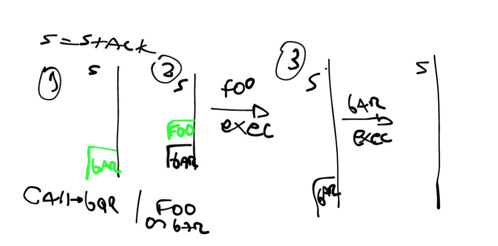
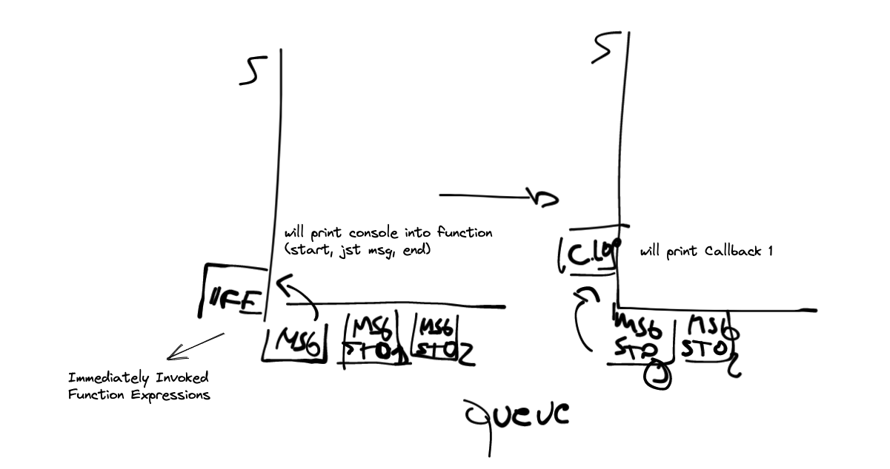
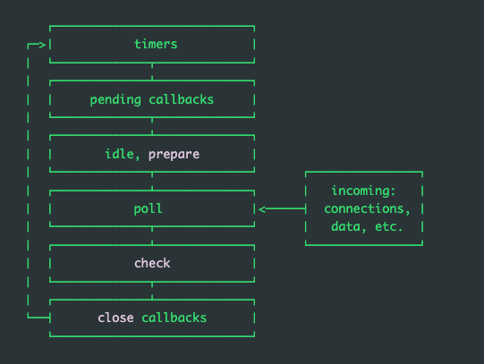

# JAVASCRIPT FUNDAMENTALS

### Functions 

Functions are first-class objects (are threated like any other variable)
```js
function hello(name) { //name is the parameter
    console.log(`Hello ${name}!`)
}

hello(`daniel`); //daniel is the argument

// Hello Daniel
```

arguments are always passed by sharing, if the object's properties are mutated, the change will impact the outside of the function

```js
function updateBrand(obj) {
  // Mutating the object is visible outside the function
  obj.brand = "Toyota";
  // Try to reassign the parameter, but this won't affect
  // the variable's value outside the function
  obj = null;
}
```
### Arrow function expressions
An arrow function expression is a compact alternative to a traditional function expression, with some semantic differences and deliberate limitations in usage:

* Arrow functions don't have their own bindings to this, arguments, or super, and should not be used as methods.
* Arrow functions cannot be used as constructors. Calling them with new throws a TypeError. They also don't have access to the new.target keyword.
* Arrow functions cannot use yield within their body and cannot be created as generator functions.

---

## Event loop
Javascript has a runtime model based on *event loop* - collecting and processing events, and executing queued sub-tasks.


> 💡 functions calls form a stack of frames


```js
function foo(b) {
    const a = 10;
    return a + b + 11;
}

function bar(x) {
    const y = 3;
    return foo(x * y);
}

const baz = bar(7);
```



The queue is a alist of messages to be processed, each has an associated function that gets called to handle the message.

Each message is processed completely before any other message is processed.

| Pros | Cons |
|---|---|
| Any function runs complete before another started | If a message takes too long to complete, app is unable too process another interaction  |

## Adding messages

this occurs anytime an event occurs and *listener for this event exists* (like click)

In [setTimeout](https://developer.mozilla.org/en-US/docs/Web/API/setTimeout) example, we can see the *time value* represents an minimun time and not *guaranteed time*, and this is because the function into setTimeout enter into Queue have to wait for other messages to be processed

```js
(() => {
  console.log("this is the start");

  setTimeout(() => {
    console.log("Callback 1: this is a msg from call back");
  }); // has a default time value of 0

  console.log("this is just a message");

  setTimeout(() => {
    console.log("Callback 2: this is a msg from call back");
  }, 0);

  console.log("this is the end");
})();

// "this is the start"
// "this is just a message"
// "this is the end"
// "Callback 1: this is a msg from call back"
// "Callback 2: this is a msg from call back"
```



Every message on the Queue add their function (or functions) associated to this message into the stack, and when the stack complete, the next message on the queue will add their functions on stack

We can use the functionality of [web workers](https://developer.mozilla.org/en-US/docs/Web/API/Web_Workers_API/Using_web_workers) to have more runtimes executing (communicated by postMessage).


# NODE JS EVENT LOOP



When NodeJS start, it initializes de event loop, dropping into the [RELP](https://nodejs.org/api/repl.html#repl_repl) the provided input script, which may make async API calls, schedule timers or call process.nextTick() and then begins processing the event loop.

## Phases

### timers

timer specifies the threshold after which a provided callback may be executed rather than the exact time a person wants it to be executed. Timers callbacks will run as early as they can be scheduled after the specified amount of time has passed; however, Operating System scheduling or the running of other callbacks may delay them

### pending callbacks

executes callbacks for some system operations such as types of TCP errors.

### pool

The poll phase has two main functions:

1. Calculating how long it should block and poll for I/O, then
2. Processing events in the poll queue.

When the event loop enters the poll phase and there are no timers scheduled, one of two things will happen:

* If the poll queue is not empty, the event loop will iterate through its queue of callbacks executing them synchronously until either the queue has been exhausted, or the system-dependent hard limit is reached.

* If the poll queue is empty, one of two more things will happen:

    * If scripts have been scheduled by setImmediate(), the event loop will end the poll phase and continue to the check phase to execute those scheduled scripts.

    * If scripts have not been scheduled by setImmediate(), the event loop will wait for callbacks to be added to the queue, then execute them immediately.


### check

This phase allows a person to execute callbacks immediately after the poll phase has completed. If the poll phase becomes idle and scripts have been queued with setImmediate(), the event loop may continue to the check phase rather than waiting.

setImmediate() and setTimeout() are similar, but behave in different ways depending on when they are called.

* setImmediate() is designed to execute a script once the current poll phase completes.
* setTimeout() schedules a script to be run after a minimum threshold in ms has elapsed.

> 💡 Note: The main advantage to using setImmediate() over setTimeout() is setImmediate() will always be executed before any timers if scheduled within an I/O cycle, independently of how many timers are present.

### close callbacks

If a socket or handle is closed abruptly (e.g. socket.destroy()), the 'close' event will be emitted in this phase. Otherwise it will be emitted via process.nextTick().

## process.nextTick()

 Any time you call process.nextTick() in a given phase, all callbacks passed to process.nextTick() will be resolved before the event loop continues. 

By placing the callback in a process.nextTick(), the script still has the ability to run to completion, allowing all the variables, functions, etc., to be initialized prior to the callback being called. It also has the advantage of not allowing the event loop to continue. It may be useful for the user to be alerted to an error before the event loop is allowed to continue. Here is the previous example using process.nextTick():

```js
let bar;

function someAsyncApiCall(callback) {
  process.nextTick(callback);
}

someAsyncApiCall(() => {
  console.log('bar', bar); // 1
});

bar = 1;
```

```js
const EventEmitter = require('events');

class MyEmitter extends EventEmitter {
  constructor() {
    super();

    // use nextTick to emit the event once a handler is assigned
    process.nextTick(() => {
      this.emit('event');
    });
  }
}

const myEmitter = new MyEmitter();
myEmitter.on('event', () => {
  console.log('an event occurred!');
});
```
